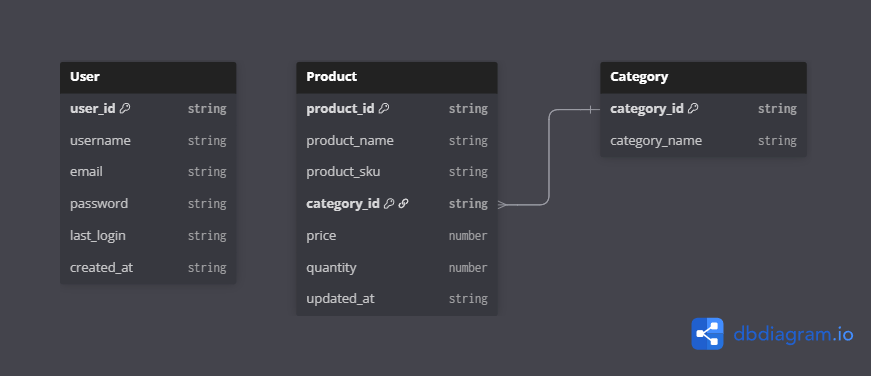

# Sin's Inventory Management System
## Introduction
Hello! This is inventory management system simulation and it is a quick project supposedly. The actual main goal for me personally is to play around with the new tech I learned which are Svelte and Flask because I thought it would be fun. I hope anyone reading this don't mind my spaghetti code in these files. In this project, I'll be simulating myself as a project manager too so you'll see brief overview of the project under this section.

> Fu Hua is working too hard for this!

## 1. Project Overview
### Project Objective
To create a centralized platform that allows user to keep track of their stock level, manage product by categories and monitor incoming/outgoing inventory in real-time.

### Problem Statement
Whether you're a small or medium scaled business, you'll eventually run into issue with manual inventory tracking and this problem can be tedious in spreadsheets or paper log. This lead to human error, stockouts or overstocking which will degrade business efficiency. This system is created to address this issue by automating the process by ensuring data integrity and ease of access.

## 2. System Requirements
### Functional Requirement
* __Product Management__: User must be able to __Create, Read, Update and Delete__ products. (CRUD basic).
* __Stock Tracking__: The system must __update quantities automatically__ when __sales or restocks are logged__.
* __Categorization__: Products should be __grouped by categories__ (e.g. Cosmetic, Food, Electronic...).
* __Search and Filter__: User must be able to __search for products by name__ or __Stock Keeping Unit__(Unique Code assigned to Product).

### Non-Functional Requirement
* __Type Safety__: Utilize TypeScript in the frontend to __catch types error__ during development or deployment.
* __Performance__: The Flask API should respond to basic queries under __300ms__.
* __Usability__: A clean, responsive Svelte interface for __mobile and desktop use__.

## 3. System Features
1. __Dashboard__: A summary view showing total items, low-stock alerts and recent activity.
2. __Inventory List__: A searchable table of all items with current stock levels.
3. __Stock Adjustment__: A simple interface to manually __"Add" or "Remove"__ stock from a specific item.

## 4. Data Classes

> Version 1

## 5. Implementation Plan
1. __Phase 1 (Frontend)__: Create the frontend with SvelteKit, prototype with sample data for example, the user/product/inventory interface and template prepared to fetch data from API.
2. __Phase 2 (Backend)__: Create the backend which will be using the Flask for the RESTApis service with routes like /products, /user and /inventory. 
3. __Phase 3 (Integration)__: Using the API template prepared in the frontend and replaced them with actual API from the backend URL then removed all sample data and replaced with real-data from APIs.